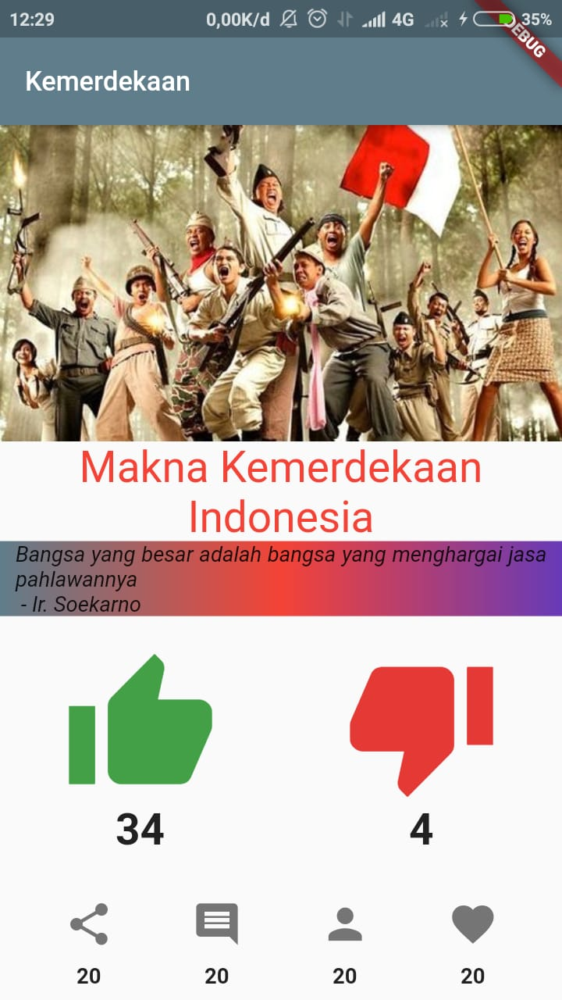

# tugas2

A new Flutter project.

# Screenshot

# Build With
VSCode with Android SDK

# Created By
Rifdatul Mufidah

# OSG 8 Eudeka
OSG 8, kelas flutter di bidang android

# OSG 8
Dalam jangka waktu lebih kurang 1 bulan, peserta diharapkan dapat memahami serta mengaplikasikan bahasa dart dalam pembuatan sebuah aplikasi

# Cara Mendaftar OSG 8 Eudeka
Diberikan pemberitahuan mengikuti kegiatan lewat email

## Getting Started

This project is a starting point for a Flutter application.

A few resources to get you started if this is your first Flutter project:

- [Lab: Write your first Flutter app](https://flutter.dev/docs/get-started/codelab)
- [Cookbook: Useful Flutter samples](https://flutter.dev/docs/cookbook)

For help getting started with Flutter, view our
[online documentation](https://flutter.dev/docs), which offers tutorials,
samples, guidance on mobile development, and a full API reference.
